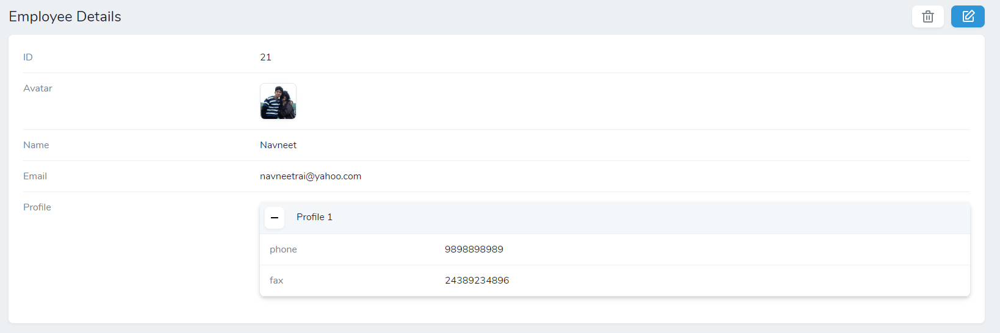
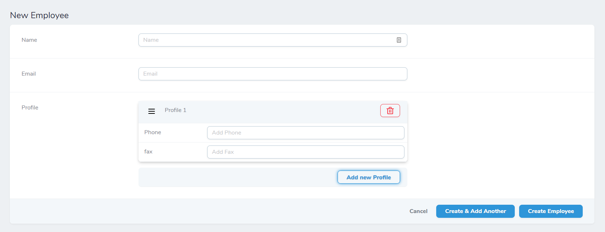
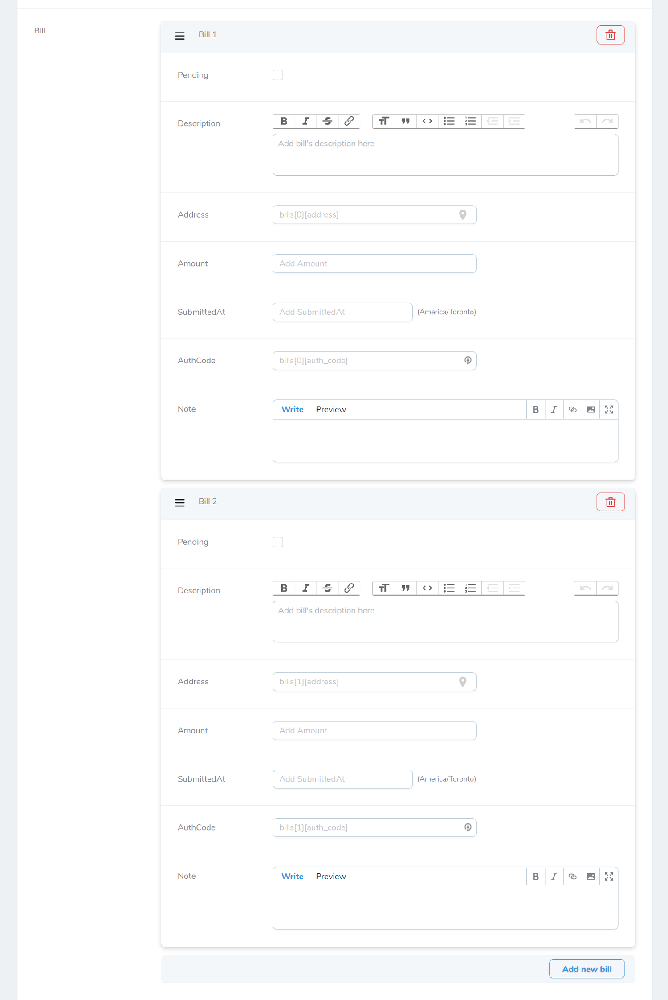
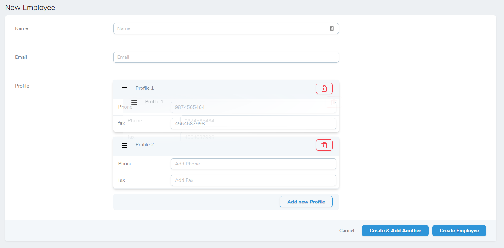
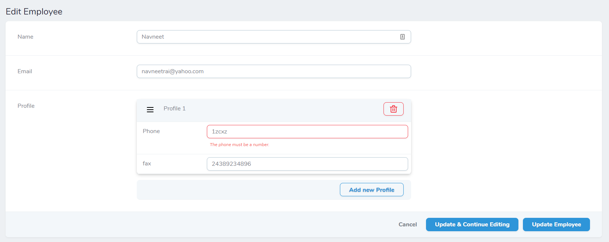

# Nova Inline Relationship

## Introduction
Nova Inline Relationship is meant to present a relationship based property as an inline property for a Laravel Nova Resource. This project is under active development, and currently only supports singular relationships. You are welcome to request or contribute by opening an issue.



## Requirements

This Nova field requires Nova 2.0 or higher.

## Installation

You can install this package in a Laravel app that uses [Nova](https://nova.laravel.com) via composer:

```bash
composer require kirschbaum-development/nova-inline-relationship
```

## Setup

After installation, your model should include the `KirschbaumDevelopment\NovaInlineRelationship\Traits\HasRelatedAttributes` trait and you must implement the `KirschbaumDevelopment\NovaInlineRelationship\Contracts\MappableRelationships` Contract.

You must also define a static `getPropertyMap` function in the model which should return the required list of properties from your related models you want to show inline.
In this example `Employee` model has two related models `EmployeProfile` and `EmployeeBill`

```php
use KirschbaumDevelopment\NovaInlineRelationship\Traits\HasRelatedAttributes;
use KirschbaumDevelopment\NovaInlineRelationship\Contracts\MappableRelationships;

class Employee extends Model implements MappableRelationships
{
    use HasRelatedAttributes;

    /**
     * @return HasOne
     */
    public function profile(): HasOne
    {
        return $this->hasOne(EmployeeProfile::class);
    }
    
    /**
     * @return HasMany
     */
    public function bills(): HasMany
    {
        return $this->hasMany(EmployeeBill::class);
    }


    /**
     * Should return property map as key value pair.
     *
     * @return array
     */
    public static function getPropertyMap(): array
    {
        return [
            'profile' => [
                'nickname' => [
                    'label' => 'nickname',
                    'component' => \Laravel\Nova\Fields\Text::class,
                    'rules' => 'required',
                    'placeholder' => 'Add Nickname',
                    'messages' => ['required' => 'You must add a :attribute for this profile.'],
                ],
                'phone' => [
                    'component' => \Laravel\Nova\Fields\Number::class,
                    'label' => 'Phone',
                    'rules' => 'required|numeric',
                    'placeholder' => 'Add Phone',
                ],
                'photo' => [
                    'component' => \Laravel\Nova\Fields\Image::class,
                ],
                'snippet' => [
                    'component' => \Laravel\Nova\Fields\Code::class,
                ],
                'country' => [
                    'component' => \Laravel\Nova\Fields\Country::class,
                ],
                'settings' => [
                    'component' => \Laravel\Nova\Fields\KeyValue::class,
                ],
                'dob' => [
                    'component' => \Laravel\Nova\Fields\Date::class,
                ],
            ],
            'bills' => [
                'pending' => [
                    'component' => \Laravel\Nova\Fields\Boolean::class,
                    'label' => 'Pending',
                ],
                'description' => [
                    'component' => \Laravel\Nova\Fields\Trix::class,
                    'label' => 'Description',
                    'placeholder' => 'Add your description here',
                ],
                'address' => [
                    'component' => \Laravel\Nova\Fields\Place::class,
                ],
                'amount' => [
                    'component' => \Laravel\Nova\Fields\Currency::class,
                ],
                'submitted_at' => [
                    'component' => \Laravel\Nova\Fields\DateTime::class,
                ],
                'auth_code' => [
                    'component' => \Laravel\Nova\Fields\Password::class,
                ],
                'notes' => [
                    'component' => \Laravel\Nova\Fields\Markdown::class,
                ],
            ],
        ];
    }
    
    // ...
}
````

## Usage

Once you add this relationship map you can add `NovaInlineRelationship` to your Model's resource with a relationship. 

```php
namespace App\Nova;

class Employee extends Resource
{
    
    //...
    public function fields(Request $request)
    {
        return [
            //...

            NovaInlineRelationship::make('Profile'),
            
            NovaInlineRelationship::make('Bills'),
        ];
    }
}
``` 
**_NOTE:_** These fields are in essence [Computed Fields](https://nova.laravel.com/docs/2.0/resources/fields.html#computed-fields), and are subjected to the same limitations. Since they are not associated with a database column, these fields will not be `sortable`.

## Adding related models


After setup you can add new related models directly while creating a new base model. For example, If you have added an `EmployeeProfile` model as a related model for your `Employee` model, you can infact add information for a related `EmployeeProfile` model without going through an additional step. You can use the `Add new Profile` button to add a new  blank profile



## Adding multiple related models

If your relationship is a `one-to-many` relationship you can add multiple related models in a one go. 



## Viewing related models

Once you add your related models and visit your base model's detail view you can watch your related models in a collapsible view. So when you will watch an `Employee` model, you can watch `EmployeeProfile` models in a collapsible view.


## Updating related models 

When you will edit your base model, you will be able to add, update and remove your related model's in a view similar to create form.

For `one-to-many` relationships you can drag and drop related models to rearrange them in relation to your base model.



## Deleting related models

You can delete related models from the base model's update view by using the `delete button` at the top right corner.

## Validating related models

You can specify the validation rule for the fields in your related model using the `getPropertyMap()` function.

An error will be displayed next to field if a validation rule is not met.



### Specifying custom error messages

You can specify custom error messages for field in format specified in the [laravel documentation](https://laravel.com/docs/5.8/validation#customizing-the-error-messages).

For every field you can specify validation messages for each rule. You can use attribute wildcards like `:attribute` in your error messages as well.

```php
use KirschbaumDevelopment\NovaInlineRelationship\Traits\HasRelatedAttributes;
use KirschbaumDevelopment\NovaInlineRelationship\Contracts\MappableRelationships;

class Employee extends Model implements MappableRelationships
{
    // ...

    /**
     * Should return property map as key value pair.
     *
     * @return array
     */
    public static function getPropertyMap(): array
    {
        return [
            'profile' => [
                'phone' => [
                    'component => Number::class,
                    'label' => 'Phone',
                    'rules' => 'required|numeric',
                    'placeholder' => 'Add Phone',
                    'messages' => [
                        'required' => 'You must add a :attribute for this profile.',
                        'numeric' => 'Your :attribute must be numeric'
                    ],
                ],
            ],
        ];
    }
    
    // ...
}
```

## Settings

You can pass on following items for your related model's attributes:-
1. `component`: The component use to render the field. You should provide the component name specified in the field like Text::class, Number::class, Boolean::class and so on.
3. `label`: Label for your field. This will also be used as the field name in error messages.
4. `rules`: A rule string in [Laravel Validation format](https://laravel.com/docs/5.8/validation#available-validation-rules).
5. `messages`: An array of error messages to be used in validation.
6. `placeholder`: A placeholder for your field.

## Supported fields

You can use any field you can add to your Nova resource with `Field::make` syntax. The following native Nova 2.0 fields are confirmed to work.

- Boolean Field
- Code Field
- Country Field
- Currency Field
- Date Field
- DateTime Field
- Markdown Field
- Number Field
- Password Field
- Place Field
- Select Field
- Text Field
- Textarea Field
- Timezone Field
- Trix Field
- Avatar Field
- Image Field
- File Field

**_NOTE:_** You can pass any additional arguments (like options for your select field) with your settings map.

## Things to Fix

1. ~~Currently for all three file field (File, Image and Avatar) File deletion is not working.~~
2. ~~relationship names with underscore might cause some issues returning values correctly.~~

## Changelog

Please see [CHANGELOG](CHANGELOG.md) for more information on what has changed recently.

## Contributing

Please see [CONTRIBUTING](CONTRIBUTING.md) for details.

## Security

If you discover any security related issues, please email brandon@kirschbaumdevelopment.com or nathan@kirschbaumdevelopment.com instead of using the issue tracker.

## Sponsorship

Development of this package is sponsored by Kirschbaum Development Group, a developer driven company focused on problem solving, team building, and community. Learn more [about us](https://kirschbaumdevelopment.com) or [join us](https://careers.kirschbaumdevelopment.com)!

## License

The MIT License (MIT). Please see [License File](LICENSE.md) for more information.
