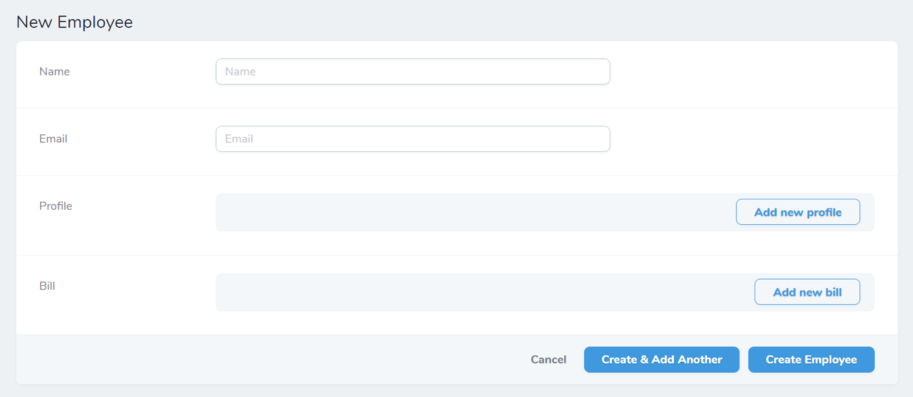

## :warning: Experimental Project / Support & Future Development

Please note that this is experimental and is not actively maintained and supported by our team. If you are interested in helping to maintain/extend this project please reach out.

Background: we initially started this project in 2019 to add inline relationship functionality to Laravel Nova. In addition to running into some significant complexities that prevented us from efficiently moving forward, Laravel Nova has since added functionality that covers most, but not all, of what we were trying to accomplish here. We recommend using those core Laravel Nova features instead of this package at this point. 


## Nova Inline Relationship

[](https://packagist.org/packages/kirschbaum-development/nova-inline-relationship)
[](https://packagist.org/packages/kirschbaum-development/nova-inline-relationship)
[](https://www.codacy.com/manual/Kirschbaum/nova-inline-relationship?utm_source=github.com&amp;utm_medium=referral&amp;utm_content=kirschbaum-development/nova-inline-relationship&amp;utm_campaign=Badge_Grade)
[](https://github.com/kirschbaum-development/nova-inline-relationship/actions)

Nova Inline Relationship allows you to manage (add/edit/update/delete/reorder) an object's relationships directly from the parent object's create/edit screens. By presenting relationships as inline properties you can provide content editors with a streamlined and efficient workflow for managing complex data.

## Requirements

This Nova field requires Nova 2.0 or higher.

## Installation

You can install this package in a Laravel app that uses [Nova](https://nova.laravel.com) via composer:

```bash
composer require kirschbaum-development/nova-inline-relationship
```

## Usage

To use `NovaInlineRelationship` in your Model's resource all you need to do is to add an inline method to the regular syntax of your related Model's Resource field(s).

If we assume that a `BlogPost` model has a one-to-many relationship with `Image`, your `BlogPost` resource would look like the following:

```php
namespace App\Nova;

use Laravel\Nova\Fields\Image;

class BlogPost extends Resource
{
    //...
    public function fields(Request $request)
    {
        return [
            //...

            HasMany::make('Images', 'images', Image::class)->inline(),
        ];
    }
}
```
**_NOTE:_** You will need to add a Nova Resource for `Image` - all of the fields and rules will be retrieved from the specified resource. You must specify the resource as the third argument to the Relationship field as illustrated above.

## Adding related models



After setup you can add new related models directly while creating a new base model. You can use the `Add new Image` button to add a new `Image` to the `BlogPost`:


## Viewing related models

Related models will also now be displayed inline as well:


## Updating related models

You can also update, re-arrange (for one-to-many relationships), and delete related models:


You can add drag and drop functionality for related models to update their order by using the `sortUsing()` method. In the following code example we use a field named `order` to store the sort order for the `Images` model:
 
 ```php
HasMany::make('Images')->inline()->sortUsing('order'),
```


## Required Relationships

Occasionally you may want to require a child relationship during the creation of a model. To do this, just use the `requireChild()` method. As an example, you may want to create a new user and enforce that a new profile for the user is also created.

```php
HasOne::make('Profile', 'profile', Profile::class)->inline()->requireChild(),
```

## Support for Third Party Packages

We have included a simple way to address some issues regarding third party packages occasionally not working with Nova Inline Relationships. These packages occasionally handle how they return their subset of fields slightly different. We have a way of easily integrating functionality for these packages. This may not work across the board, but should allow for most third party packages.

You must publish the configs for this package with

```shell script
php artisan vendor:publish
```

This will publish a config file as `config/nova-inline-relationships.php`. Add your custom namespaced paths within the `third-party` array. For example:

```php
'third-party' => [
    'App\Nova\ThirdPartyIntegrations',
    'KirschbaumDevelopment\NovaInlineRelationship\Integrations',
]
``` 

Create a new class inside that namespace that looks like the following:

```php
<?php

namespace App\Nova\ThirdPartyIntegrations;

use KirschbaumDevelopment\NovaInlineRelationship\Integrations\ThirdParty;
use KirschbaumDevelopment\NovaInlineRelationship\Integrations\Contracts\ThirdPartyContract;

class SomeThirdPartyField extends ThirdParty implements ThirdPartyContract
{
    /**
     * Fields array from object.
     *
     * @return array
     */
    public function fields(): array
    {
        // The following is just an example and should be updated to meet your needs.
        return $this->field->customFieldArray;
    }
}
```

The name of the class is very important. It should be the same name as the field used within the Nova resource. If the field class is `CustomField`, the third party integration class should also be called `CustomField`.

The `fields()` method should return an array of all the custom field's or package's fields array.

If you feel that the third party integration you've created should be included in this package, please create a pull request and we will look over it! 

## Supported Relationships

The following eloquent relationships are currently supported:

- BelongsTo
- HasOne
- HasMany
- MorphOne
- MorphMany

## Supported fields

The following native Nova 2.0 fields are confirmed to work.

- Boolean
- Code
- Country
- Currency
- Date
- DateTime
- Markdown
- Number
- Password
- Place
- Select
- Text
- Textarea
- Timezone
- Trix
- Avatar
- Image
- File

## Changelog

Please see [CHANGELOG](CHANGELOG.md) for more information on what has changed recently.

## Contributing

Please see [CONTRIBUTING](CONTRIBUTING.md) for details.

## Security

If you discover any security related issues, please email navneet@kirschbaumdevelopment.com or nathan@kirschbaumdevelopment.com instead of using the issue tracker.

## Sponsorship

Development of this package is sponsored by Kirschbaum Development Group, a developer driven company focused on problem solving, team building, and community. Learn more [about us](https://kirschbaumdevelopment.com) or [join us](https://careers.kirschbaumdevelopment.com)!

## License

The MIT License (MIT). Please see [License File](LICENSE.md) for more information.
