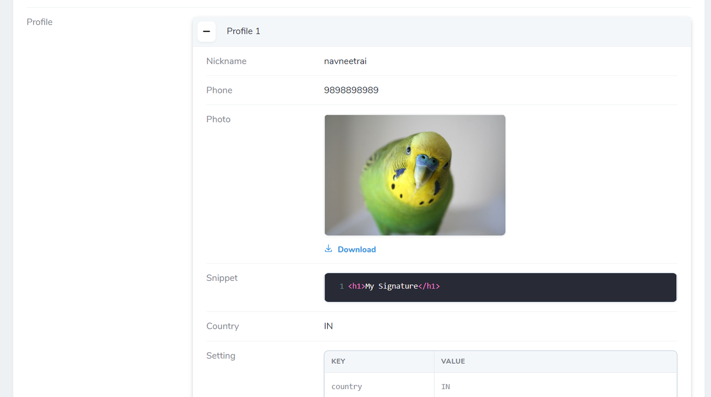
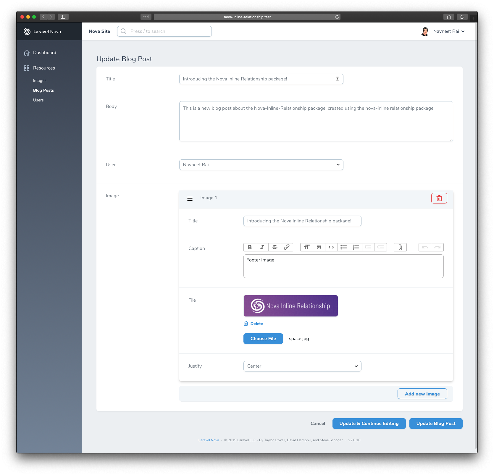

## Nova Inline Relationship
Nova Inline Relationship is meant to present a relationship based property as an inline property for a Laravel Nova Resource.

## Requirements

This Nova field requires Nova 2.0 or higher.

## Installation

You can install this package in a Laravel app that uses [Nova](https://nova.laravel.com) via composer:

```bash
composer require kirschbaum-development/nova-inline-relationship
```

## Usage

To use `NovaInlineRelationship` in your Model's resource all you need to do is to add an inline method to the regular syntax of your related Model's Resource field(s).

If we assume that a `BlogPost` model has a one-to-many relationship with `Image`, your `BlogPost` resource would like the following:

```php
namespace App\Nova;

class BlogPost extends Resource
{
    //...
    public function fields(Request $request)
    {
        return [
            //...

            HasMany::make('Images', 'images', Image::class)->inline(),
        ];
    }
}
```
**_NOTE:_** You will need to add a Nova Resource for `Image` - all of the fields and rules will be retrieved from the specified resource. You must specify the resource as the third argument to the Relationship field.

## Adding related models


After setup you can add new related models directly while creating a new base model. You can use the `Add new Image` button to add a new `Image` to the `BlogPost`:


## Viewing related models

Related models will also now be displayed inline as well:



## Updating related models

You can also update, re-arrange (for one-to-many relationships), and delete related models:



## Supported fields

The following native Nova 2.0 fields are confirmed to work.

- Boolean
- Code
- Country
- Currency
- Date
- DateTime
- Markdown
- Number
- Password
- Place
- Select
- Text
- Textarea
- Timezone
- Trix
- Avatar
- Image
- File

## Changelog

Please see [CHANGELOG](CHANGELOG.md) for more information on what has changed recently.

## Contributing

Please see [CONTRIBUTING](CONTRIBUTING.md) for details.

## Security

If you discover any security related issues, please email navneet@kirschbaumdevelopment.com or nathan@kirschbaumdevelopment.com instead of using the issue tracker.

## Sponsorship

Development of this package is sponsored by Kirschbaum Development Group, a developer driven company focused on problem solving, team building, and community. Learn more [about us](https://kirschbaumdevelopment.com) or [join us](https://careers.kirschbaumdevelopment.com)!

## License

The MIT License (MIT). Please see [License File](LICENSE.md) for more information.
